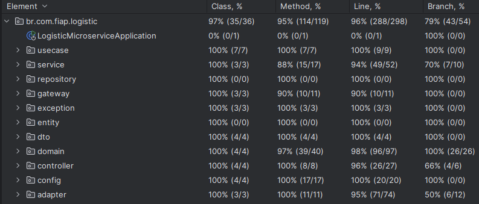

# Logistic Microservice

Este é um microserviço de logística desenvolvido em Java utilizando Spring Boot. Ele gerencia entregadores, rastreamento e pedidos, incluindo a criação, atualização e consulta de informações.

## Tecnologias Utilizadas

- **Linguagem**: Java 17
- **Framework**: Spring Boot 3.4.2
- **Banco de Dados**: PostgreSQL (ou H2 para testes)
- **ORM**: Spring Data JPA
- **Testes**: JUnit 5, RestAssured
- **Gerenciamento de Dependências**: Maven
- **Documentação da API**: SpringDoc OpenAPI

## Estrutura do Projeto

- `src/main/java/br/com/fiap/logistic/`
    - `adapter/`: Contém classes de conversão entre diferentes camadas do sistema.
    - `controller/`: Contém os controllers responsáveis pelas requisições HTTP.
    - `domain/`: Contém as classes de domínio do sistema.
    - `dto/`: Contém as classes de Data Transfer Object (DTO).
    - `entity/`: Contém as entidades JPA.
    - `gateway/`: Contém as interfaces de gateway.
    - `gateway/impl/`: Contém as implementações das interfaces de gateway.
    - `repository/`: Contém os repositórios JPA.
    - `usecase/`: Contém os casos de uso das regras de negócio.
    - `service/`: Contém os serviços de negócio.

## Como Executar

### 1. Navegar até o diretório do projeto

```sh
cd logistic-microservice
```

### 2. Configurar o Banco de Dados PostgreSQL

Certifique-se de que um banco de dados PostgreSQL esteja rodando e configure a conexão no `application.properties`:

```properties
spring.datasource.url=jdbc:postgresql://localhost:5432/logistic_db
spring.datasource.username=seu_usuario
spring.datasource.password=sua_senha
spring.jpa.hibernate.ddl-auto=update
spring.jpa.show-sql=true
```

Caso prefira rodar o banco via Docker, utilize o comando:

```sh
docker run -d --name logistic-db -e POSTGRES_USER=seu_usuario -e POSTGRES_PASSWORD=sua_senha -e POSTGRES_DB=logistic_db -p 5432:5432 postgres:latest
```

### 3. Compilar o projeto

```sh
mvn clean install
```

### 4. Executar a aplicação

```sh
mvn spring-boot:run
```

A aplicação estará acessível em: `http://localhost:8080`

## Endpoints

### Entregadores (`/delivery-person`)

- **POST /delivery-person**: Cria um novo entregador.
- **PUT /delivery-person/assign**: Atribui um entregador a um pedido.
- **PUT /delivery-person/{orderId}/complete**: Marca a entrega como concluída.

### Pedidos (`/orders`)

- **POST /orders**: Cria um novo pedido.
- **GET /orders/{id}**: Retorna as informações de um pedido pelo ID.
- **GET /orders?zipCode=XXXXX-XXX**: Retorna pedidos filtrados por CEP.
- **PUT /orders/{id}/status?status=NEW_STATUS**: Atualiza o status de um pedido.

### Rastreamento (`/trackings`)

- **PUT /trackings/{trackingId}/location?latitude=XX.XXXX&longitude=XX.XXXX**: Atualiza a localização do rastreamento.
- **GET /trackings?latitude=XX.XXXX&longitude=XX.XXXX**: Retorna rastreamentos pela localização.

## Executando os Testes

A aplicação possui testes automatizados utilizando RestAssured e JUnit. Para executá-los, utilize:

```sh
mvn test
```

A cobertura de testes e suas porcentagens podem ser visualizadas na imagem abaixo:



## Documentação da API

A documentação interativa da API (Swagger) pode ser acessada após iniciar a aplicação:

```
http://localhost:8080/swagger-ui/index.html
```