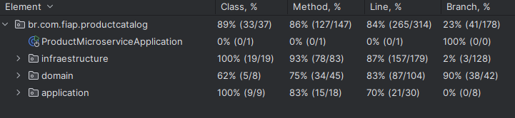

# Documentação do Microserviço de Produto

## Descrição
Este microserviço é responsável pela gestão de produtos, permitindo a adição e remoção de estoque, além de fornecer informações detalhadas sobre os produtos disponíveis.

## Tecnologias Utilizadas
- **Java 17**: Linguagem utilizada no desenvolvimento.
- **Spring Boot**: Framework para construção do microserviço.
- **Spring Data JPA**: Abstração para interação com o banco de dados relacional.
- **PostgreSQL**: Banco de dados utilizado para persistência dos dados.
- **Docker**: Contêinerização do microserviço e do banco de dados.
- **Maven**: Gerenciador de dependências e build do projeto.

## Estrutura do Projeto
A estrutura do projeto segue a convenção padrão do Spring Boot com a arquitetura Clean Arch, com a adição de arquivos específicos para a contêinerização com Docker.

### 1. **Importação em Lote de Produtos**
- **POST** `/batch/import`
    - **Descrição**: Este endpoint recebe um arquivo contendo os dados dos produtos e os processa em lote.
    - **Parâmetros**:
        - `file`: Arquivo contendo os dados dos produtos em formato CSV.
        - `milliseconds`: Tempo (em milissegundos) para o processamento.
    - **Exemplo de uso**:
        - Este é o primeiro endpoint a ser chamado para testar a aplicação. Você deve enviar um arquivo com dados de produtos e um valor para o parâmetro `milliseconds`.
        - Caso queira um arquivo pronto, pode utilizar o [produtos_fake.csv](docs/produtos_fake.csv)

### 2. **Gerenciamento de Categorias**
- **GET** `/categories`
    - **Descrição**: Retorna uma lista de todas as categorias de produtos.
    - **Resposta**: Lista de objetos `Category`.

### 3. **Gerenciamento de Produtos**
- **POST** `/product/addStock`
    - **Descrição**: Adiciona estoque a um produto.
    - **Parâmetros**: Corpo da requisição contendo `productId` e `quantity`.
    - **Exemplo de uso**:
        - Requisição:
          ```json
          {
            "productId": 1,
            "quantity": 100
          }
          ```

- **POST** `/product/removeStock`
    - **Descrição**: Remove estoque de um produto.
    - **Parâmetros**: Corpo da requisição contendo `productId` e `quantity`.
    - **Exemplo de uso**:
        - Requisição:
          ```json
          {
            "productId": 1,
            "quantity": 50
          }
          ```

- **GET** `/product/{productId}/stock`
    - **Descrição**: Consulta o estoque de um produto específico.
    - **Parâmetros**: `productId` (ID do produto).
    - **Resposta**: Quantidade de estoque do produto.

- **GET** `/product`
    - **Descrição**: Lista todos os produtos.
    - **Resposta**: Lista de objetos `Product`.

### 4. **Mensagem para Remover Estoque**
- **Consumidor (via RabbitMQ)**:
    - **Descrição**: Este endpoint é invocado quando uma mensagem para remover estoque é recebida via RabbitMQ.
    - **Ação**: Executa a remoção de estoque para o produto conforme os dados da mensagem.

## Configuração do Docker

### `docker-compose.yml`
O Docker Compose é utilizado para orquestrar a aplicação e o banco de dados PostgreSQL. Abaixo, a configuração de cada serviço:

- **Serviço `app`**: Contêiner do microserviço de produto.
    - Porta exposta: `8080`
    - Variáveis de ambiente:
        - `SPRING_DATASOURCE_URL`: URL do banco de dados PostgreSQL.
        - `SPRING_DATASOURCE_USERNAME`: Nome de usuário do banco de dados.
        - `SPRING_DATASOURCE_PASSWORD`: Senha do banco de dados.

- **Serviço `postgres`**: Contêiner do banco de dados PostgreSQL.
    - Porta exposta: `5544`
    - Variáveis de ambiente:
        - `POSTGRES_USER`: Nome de usuário do banco de dados.
        - `POSTGRES_PASSWORD`: Senha do banco de dados.
        - `POSTGRES_DB`: Nome do banco de dados.

### Dockerfile
Este arquivo define o processo de construção do microserviço:

- **Fase 1**: Compilação do código usando Maven.
- **Fase 2**: Execução do JAR utilizando Amazon Corretto com Alpine Linux para otimizar o tamanho da imagem Docker.

## Como Executar

### Passo 1: Clone o repositório
Clone o repositório para sua máquina local:
```sh
cd productms-api
```

### Passo 2: Compile o projeto
Compile o projeto utilizando Maven, incluindo todas as dependências:
```sh
mvn clean package -DskipTests
```

### Passo 3: Configure o Docker
Certifique-se de que você tenha o Docker e o Docker Compose instalados. Em seguida, execute o seguinte comando para inicializar os serviços definidos no `docker-compose.yml`:

```sh
docker-compose up --build
```

Isso criará os contêineres para o microserviço e o PostgreSQL. A aplicação estará disponível na porta `8080`.

### Passo 4: Acesse a API
Com os contêineres em execução, você pode acessar a API através da URL `http://localhost:8080`. Utilize as ferramentas de sua escolha (por exemplo, Postman ou cURL) para fazer requisições aos endpoints definidos.

## Executando os Testes

A aplicação possui testes automatizados utilizando RestAssured e JUnit. Para executá-los, utilize:

```sh
mvn test
```

A cobertura de testes e suas porcentagens podem ser visualizadas na imagem abaixo:



## Documentação da API

A documentação interativa da API (Swagger) pode ser acessada após iniciar a aplicação:

```
http://localhost:8080/swagger-ui/index.html
```

## Licença
Este projeto está licenciado sob a licença MIT. Consulte o arquivo `LICENSE` para mais detalhes.
